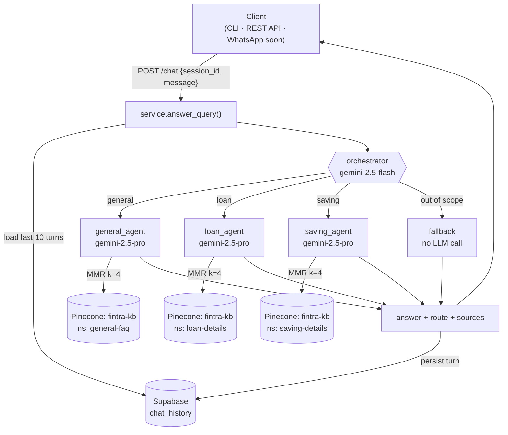

# Fintra — Multi-Agent RAG Platform

**A production-style, multi-agent Retrieval-Augmented Generation assistant** for a fictional financial institute, *Morgan Treasuries* — built on a LangGraph hub-and-spoke architecture with Vertex AI (Gemini), Pinecone, and Supabase.

---

### Special Note for the H2O.ai Technical Recruitment Team

Welcome! First of all, thank you for taking the time to review my application and profile.

In my application, I highlighted my experience in architecting and deploying production-grade **Agentic Platforms**. Due to a strict **Non-Disclosure Agreement (NDA)** with my current/previous organization, I am legally restricted from sharing the source code, live URLs, or repositories of those specific enterprise platforms.

However, to demonstrate my hands-on expertise in multi-agent orchestration, state management, and tool integration, **I am actively building this open-source platform from scratch specifically for this interview process.**

*Please Note: This repository is currently a work-in-progress (active development). I am rapidly pushing updates to showcase how I approach engineering autonomous systems, prompt optimization, and agent loops.*

---

### 💡 Technical Deep Dive & Discussion Ready

While the proprietary code must remain confidential, I am fully prepared and excited to deep-dive into the following during our technical interview:

1. **Platform Architecture:** Highlighting how I engineered scalable, event-driven agent runtimes, LLM abstraction layers, and memory/context management systems.
2. **My Core Contributions:** Detailing my exact ownership—from designing the orchestration engine and tool-calling validation pipelines to optimizing latency and token throughput.
3. **Production Challenges:** Discussing how I solved real-world agentic friction, including handling infinite loops, state drift, hallucination mitigation, and cost-efficient scaling.

---

## Architecture



**Hub-and-spoke:** an orchestrator (cheap, fast model) classifies each query with structured output and dispatches to exactly **one** domain specialist via LangGraph conditional edges. Spokes terminate — they never call each other, so latency and cost are bounded and behaviour is predictable.

| Agent | Model | Pinecone namespace | Scope |
|---|---|---|---|
| `orchestrator` | gemini-2.5-flash | — | Query classification (structured output) |
| `general_agent` | gemini-2.5-pro | `general-faq` | Company info, board, products overview |
| `loan_agent` | gemini-2.5-pro | `loan-details` | Loans **and leasing**, gold loans, eligibility |
| `saving_agent` | gemini-2.5-pro | `saving-details` | Fixed deposits, savings accounts, rates |
| `fallback` | *(none — deterministic)* | — | Out-of-scope guardrail, zero cost, injection-proof |

### Design decisions worth noting

- **Registry-driven platform** ([`agents/registry.py`](src/fintra/agents/registry.py)): each agent is a declarative `AgentSpec` (route, namespace, routing description, persona). The router prompt *and* the graph topology are generated from it — adding a new banking domain is one registry entry plus one `data/` folder, zero graph changes.
- **Retrieval quality** ([`retrieval/`](src/fintra/retrieval/)): cosine similarity + **Maximal Marginal Relevance** (λ=0.5, `fetch_k=10`, `k=4`) to maximise context coherence while eliminating near-duplicate chunks. Embeddings are `gemini-embedding-001` pinned to 768 dims with asymmetric task types (`RETRIEVAL_DOCUMENT` / `RETRIEVAL_QUERY`).
- **Conversational memory** ([`memory/history.py`](src/fintra/memory/history.py)): every turn is persisted per `session_id`; the last N turns are injected into both the router (so follow-ups route correctly) and the agent (so pronouns resolve). Stateless LLM, stateful platform.
- **Cost discipline**: the only paid service is Vertex AI. Routing runs on flash, generation on pro *only after* routing, fallback costs nothing, and the entire test suite runs with mocks — no paid calls in CI.
- **One entrypoint** ([`service.py`](src/fintra/service.py)): CLI, REST API, and the upcoming WhatsApp webhook all call the same `answer_query(session_id, message)` — the API contract already matches WhatsApp's needs (`session_id` = sender phone number).

## Tech Stack

| Concern | Choice |
|---|---|
| Orchestration | **LangGraph** (hub-and-spoke `StateGraph`, conditional edges) |
| LLMs | **Vertex AI**: `gemini-2.5-flash` (routing) / `gemini-2.5-pro` (generation) |
| Embeddings | `gemini-embedding-001` @ 768d |
| Vector DB | **Pinecone** serverless — one index, namespace-partitioned |
| Memory store | **Supabase** Postgres (`chat_history`) |
| Glue | **LangChain** (model wrappers, MMR retriever, splitters, structured output) |
| API | **FastAPI** + Pydantic validation |
| Config | pydantic-settings — every model ID and retrieval parameter is env-driven |

## Quickstart

```bash
# 1. install
python -m venv .venv && .venv\Scripts\activate
pip install -e .

# 2. configure - copy .env.example to .env and fill in credentials
#    (GCP service-account key with "Vertex AI User" role, Pinecone, Supabase)

# 3. provision infrastructure (idempotent)
python scripts/bootstrap_pinecone.py        # creates the 768d cosine index
#    run scripts/bootstrap_supabase.sql once in the Supabase SQL editor
python scripts/smoke_vertex.py              # verifies all three Vertex endpoints
python scripts/check_supabase.py            # verifies chat_history round-trip

# 4. ingest the knowledge base
python scripts/ingest.py                    # chunk -> embed -> upsert per namespace

# 5. chat
python scripts/chat_cli.py --session me     # terminal
uvicorn fintra.api.app:app --reload         # REST API -> http://127.0.0.1:8000/docs
```

```jsonc
// POST /chat
{ "session_id": "94771234567", "message": "What rate does Flexy Fix pay on 2 million?" }
// -> { "route": "saving", "answer": "...earns an interest rate of 7.00%.", "sources": ["saving-details/saving-details.md"] }
```

## Project Structure

```
src/fintra/
├── config.py               # pydantic-settings - all tunables from .env
├── llm.py                  # Vertex chat-model factories
├── prompts.py              # router / RAG / fallback prompts
├── service.py              # answer_query(): memory -> graph -> persist
├── agents/registry.py      # AgentSpec registry - the extension point
├── graph/
│   ├── state.py            # GraphState
│   ├── nodes.py            # orchestrator, RAG-agent factory, fallback
│   └── builder.py          # StateGraph assembly from the registry
├── retrieval/
│   ├── embeddings.py       # gemini-embedding-001 @ 768d, task-typed
│   └── vectorstore.py      # Pinecone + MMR retriever per namespace
├── memory/history.py       # per-session chat history (Supabase)
└── api/app.py              # FastAPI: POST /chat, GET /health
scripts/                    # bootstrap, smoke tests, ingest, CLI
data/                       # knowledge base (folder name = namespace)
tests/                      # 17 tests, fully mocked - zero paid calls
```

## Testing

```bash
pytest tests -q     # 17 passed - runs offline, mocks every external service
```

Covers: registry invariants, routing decisions (including unknown-route degradation to fallback), end-to-end graph execution with mocks, history injection for coreference, API contract, input validation, and error-detail hiding.

## Roadmap

- [x] Phases 0–5: infrastructure, ingestion, LangGraph core, memory, CLI, REST API
- [x] **WhatsApp integration** — Meta Cloud API webhook (`GET/POST /webhook`), Vercel serverless deployment ([docs/DEPLOY.md](docs/DEPLOY.md))
- [ ] **Redis caching** — read-through cache in front of Supabase history + response cache for repeated FAQs
- [ ] **MCP integration** — expose the assistant's retrieval and answering as Model Context Protocol tools
- [ ] **Hybrid search** — BM25 + dense fusion via RRF (`EnsembleRetriever`) for exact-term recall (rates, product names)
- [ ] **Query rewriting** — history-aware retrieval: condense follow-ups into standalone queries before embedding
- [ ] **Reranking** — cross-encoder second stage once the corpus outgrows `fetch_k` (dense+BM25 → RRF → rerank → MMR)
- [ ] Structured evaluation harness — routing accuracy + answer groundedness scoring

---

Feel free to track my commit history to see the platform take shape! I look forward to discussing how my experience aligns with the cutting-edge AI orchestration happening at H2O.ai.
